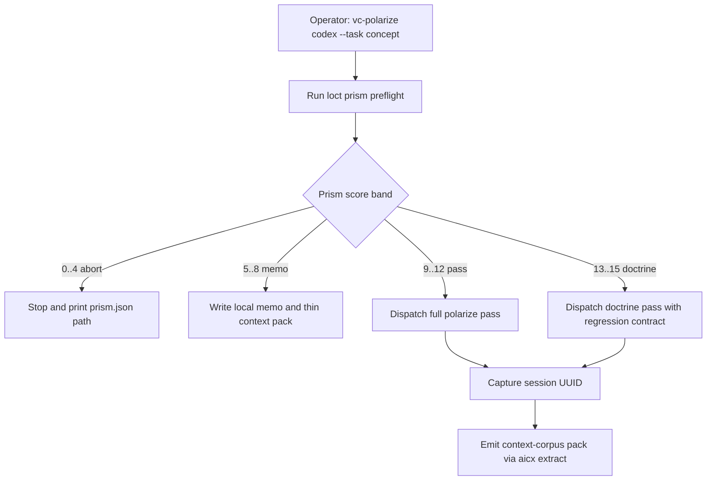

# `vc-polarize` Flow

> Front-face: `vc-polarize`. The runner gates task-based launches through
> Loctree prism score before any agent dispatch.

## Flow

## Routes

| Band     | Score    | Runner action                                    | Agent dispatch |
| -------- | -------- | ------------------------------------------------ | -------------- |
| abort    | `0..4`   | Print operator-visible rejection and prism path  | no             |
| memo     | `5..8`   | Emit local memo and thin context-corpus sidecar  | no             |
| pass     | `9..12`  | Run the full polarize prompt with prism evidence | yes            |
| doctrine | `13..15` | Run doctrine pass with regression expectation    | yes            |

### Context Corpus

- `pass` and `doctrine`: capture `session: <uuid>` from agent stdout and wrap
  `aicx extract --agent <agent> --session <uuid> --output <raw-path>`.
- `memo`: write only a thin local memo pack with `learning_use.allowed` limited
  to `format_examples`.
- `abort`: do not write context-corpus output.
- `--no-context-corpus`: skip optional pack emission without failing dispatch.
