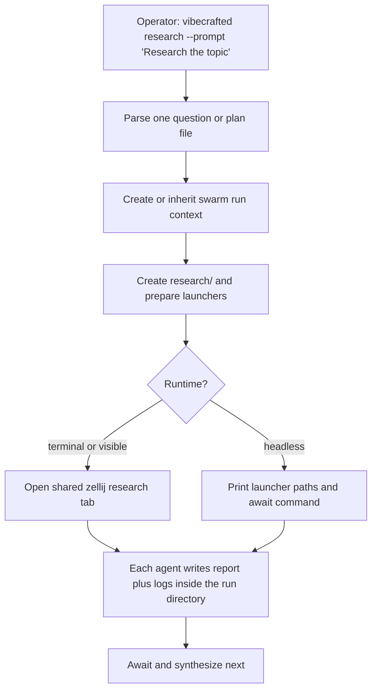

# `vc-research` Flow

## Flow

## Routes

| Entry                                      | Args         | Produces                      | Exit            |
| ------------------------------------------ | ------------ | ----------------------------- | --------------- |
| `vibecrafted research --prompt <text>`     | question     | swarm launch plus run context | `0` on dispatch |
| `vibecrafted research --file <plan.md>`    | plan file    | same                          | `0` on dispatch |
| `vibecrafted research await --run-id <id>` | run selector | await/summary output          | `0` on read     |
| `vc-research --prompt\|--file`             | same         | same                          | `0` on dispatch |

### Escalation edges

- Research is complete and the team wants a plan -> `vibecrafted scaffold <agent>`
- Research is complete and execution should start -> `vibecrafted workflow <agent>` or `implement` (alias: `justdo`)
- Research needs one strong owner instead of a swarm -> `vibecrafted <agent> research <plan.md>`

### Session artifacts

- Artifact root: `$VIBECRAFTED_HOME/artifacts/<org>/<repo>/<YYYY_MMDD>/research/<run_id>/`
- Lock: `$VIBECRAFTED_HOME/locks/<org>/<repo>/<run_id>.lock`
- Human surface: `summary.md` plus `reports/{claude,codex,gemini}.md`
- Internal audit: `logs/{claude,codex,gemini}.meta.json`, transcripts, raw streams, runtime prompts, launchers, and layout under `logs/` and `tmp/`
